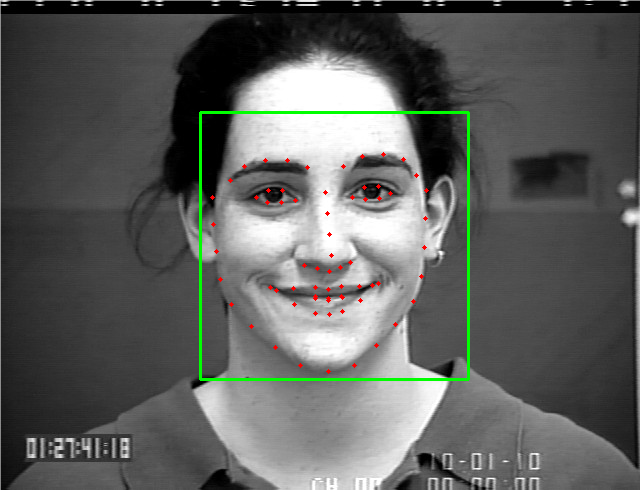
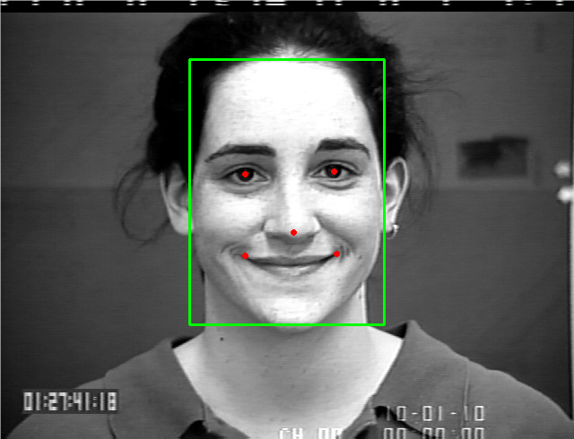
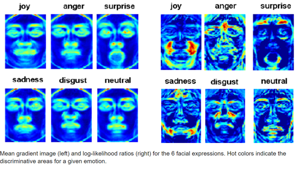

# Exploring Feature Extraction Methods for Facial Expression Recognition Systems

## Introduction

This project investigates various feature extraction methods for Facial Expression Recognition (FER) systems. The goal is to explore the effectiveness of different feature detection techniques combined with machine learning models to classify facial expressions accurately.

## Project Structure

The project follows a structured pipeline consisting of the following steps:

1. **Image Acquisition** - Collecting images or video frames from datasets such as CK+.
2. **Face Detection & Pre-processing** - Identifying and segmenting faces in the input images.
3. **Feature Extraction** - Applying various feature detection and description methods.
4. **Classification** - Using machine learning techniques like Support Vector Machines (SVMs) for expression classification.

## Feature Extraction Methods Implemented

The following feature extraction techniques are studied in this project:

### 1. Face Detection

A face detection algorithm is applied to extract face regions from video frames, using MATLAB's `vision.CascadeObjectDetector()`.

    
    

### 2. Local Binary Patterns (LBP)

- Analyzes texture by comparing neighboring pixels.
- Converts images into histograms of LBP codes for classification.

    

### 3. Gabor Filter

- A linear bandpass filter used for texture analysis.
- Features are extracted based on wave parameters such as wavelength and orientation.

### 4. Histogram of Oriented Gradients (HOG)

- Detects object shapes using gradients in small image blocks.
- Used to identify facial muscle movements for expression classification.

### 5. Maximally Stable Extremal Regions (MSER)

- Detects stable regions in an image for robust feature extraction.
- Used in combination with HOG to improve performance.

### 6. Features from Accelerated Segment Test (FAST)

- A corner detection algorithm used for feature point extraction.
- Helps in recognizing distinctive facial features.

### 7. Oriented FAST and Rotated BRIEF (ORB)

- A computationally efficient alternative to SIFT and SURF.
- Extracts keypoints and assigns orientations for facial feature recognition.

### 8. Optical Flow

- Tracks motion of facial features across video frames.
- Useful for analyzing expression transitions dynamically.

    

## Implementation Details

- The project utilizes MATLAB for feature extraction and visualization.
- Machine learning models, specifically SVMs, are employed for classification.
- Image datasets such as CK+ are used for training and evaluation.

## Results & Observations

- HOG combined with SVM provided the highest accuracy in expression recognition.
- LBP and Gabor features performed well for static image classification.
- Optical Flow showed promising results in tracking dynamic facial expressions.
- For a more detailed analysis and discussion of the findings, please refer to the document available in the `docs` directory:  
📄 **[Exploring Feature Extraction Methods for Facial Expression Recognition Systems](docs/Exploring%20Feature%20Extraction%20Methods%20for%20Facial%20Expression%20Recognition%20Systems.pdf)**.

## References

- Carcagnì, P. et al., "Facial expression recognition and histograms of oriented gradients: a comprehensive study."
- Chen, J. et al., "Facial Expression Recognition Based on Facial Components Detection and HOG Features."
- Hernández-Pérez, B. (2021), "Facial Expression Recognition with LBP and ORB Features."
- Kyrkou, C. (2018), "Object Detection Using Local Binary Patterns."
- Tyagi, D. (2019), "Introduction to ORB and FAST Feature Detection."

